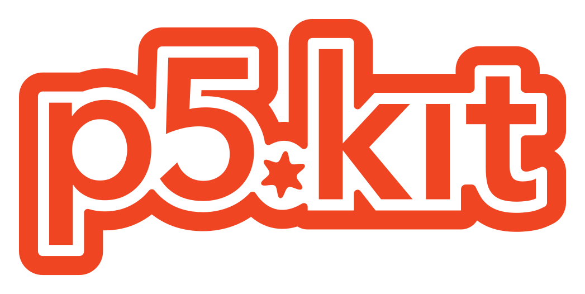

	

---

# p5.kit
p5.kit is a component-library for svelte to build tools on top of [p5.js](https://p5js.org/).

# roadmap
p5.kit is heavily in development, its (planned) features are:
- Basic Sketch-Component ✅
- Export of videos and images ✅
- Big toolkit of components: Dropdown, Slider, Colorpicker, Toggle, File-Uploader.... ❌
- Theming: easily style existing components ❌
- Custom Components: API for creating components that integrate into p5.kit ❌
